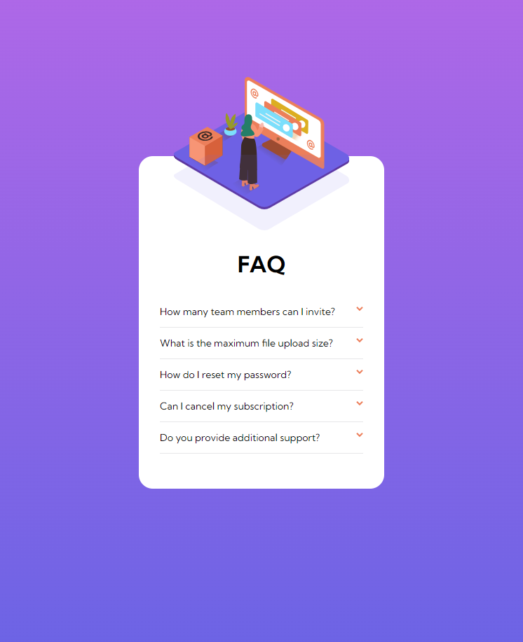
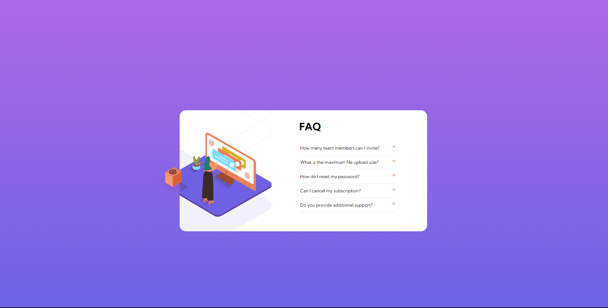

# Results summary component

## Table of contents

- [Overview](#overview)
- [Style Guide](#style-guide)
  - [Layout](#layout)
  - [Colors](#colors)
  - [Typography](#typography)
- [Screenshot](#screenshot)
- [Links](#links)
- [My process](#my-process)
  - [Built with](#built-with)
  - [What I learned](#what-i-learned)
  - [Useful resources](#useful-resources)
- [Author](#author)

## Overview

Users should be able to:

- View the optimal layout for the component depending on their device's screen size
- See hover states for all interactive elements on the page
- Hide/Show the answer to a question when the question is clicked

## Style Guide
### Layout
The designs were created for the following widths:
- Mobile: 375px
- Desktop: 1440px
### Colors
- Very dark desaturated blue: hsl(238, 29%, 16%)
- Soft red: hsl(14, 88%, 65%)
- Soft violet: hsl(273, 75%, 66%)
- Soft blue: hsl(240, 73%, 65%)
- Very dark grayish blue: hsl(237, 12%, 33%)
- Dark grayish blue: hsl(240, 6%, 50%)
- Light grayish blue: hsl(240, 5%, 91%)
### Typography
- Font size: 12px
- Family: [Hanken Grotesk](https://fonts.google.com/specimen/Hanken+Grotesk)
- Weights: 500, 700, 800

## Screenshot






## Links

- Live Site URL: [Github Pages Hosting](https://stevenoyes.github.io/faq-acc-card/)

## My process
### Built with

- Mobile-first development
- Semantic HTML5
- CSS

### What I learned

```html

```


```css

```

### Useful resources

- [Mozilla Developers Network](https://developer.mozilla.org/en-US/) - Documenting for web technologies, including CSS, HTML, and JavaScript.
- [Transfonter](https://transfonter.org/) - Modern and simple css @font-face generator. TTF, OTF, WOFF, WOFF2 or SVG, 15 MB per file.
- [The Markdown Guide](https://markdownguide.org/) - If you want more help with writing markdown, I'd recommend checking out their site to learn more.

## Author

- Website - [Portfolio](https://stevenmnoyes.com)
- Github - [Github Profile](https://github.com/SteveNoyes/)
- LinkedIn - [LinkedIn Profile](https://www.linkedin.com/in/steven-noyes/)